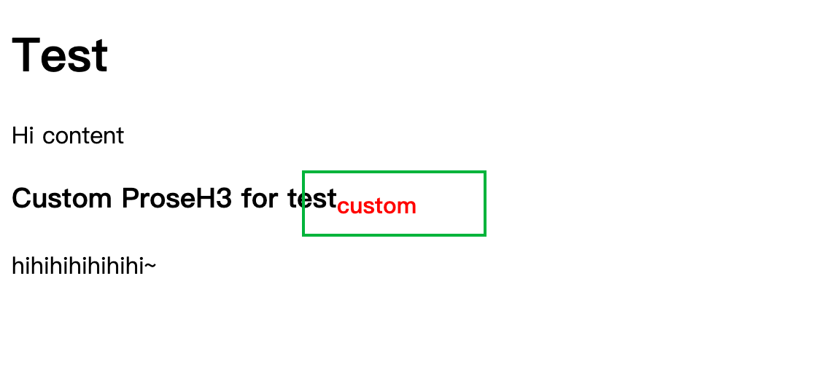
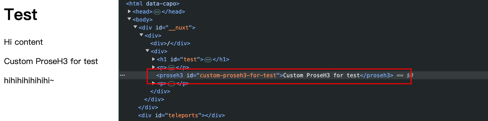

# Bug for Custom Prose component overwriting default Prose component

This is a bug report for the Custom Prose component overwriting the default Prose component.

They behave differently in different environments.

<!-- Dev 和 Prod 表格 -->
| dev ✅ | prod ❎ |
| --- | --- |
|  |  |
